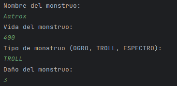
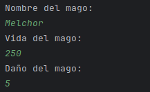
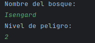
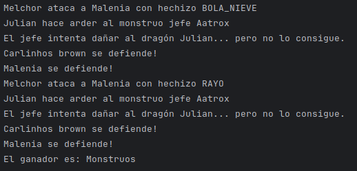

## Manual de usuario

Dragolandia es un juego de turnos automático basado en la aleatoriedad.  
Al iniciar la aplicación pide que ingreses los datos de los monstruos y del mago a través de la consola integrada.  

Después debes ingresar el nombre del entorno Bosque.

El dragón se genera sólo, pues no es un personaje personalizable ni jugable.  
La batalla se desarrolla a través de la consola, culminando con un ganador al final.  
Las rondas dependen de la aleatoriedad y los valores que ajusta el jugador.

